# JLMIRROR — Current Architecture Audit

> **Generated:** 2026-08-11
> **Scope:** Complete reverse-engineering of the codebase (backend, frontend, database schemas, ORM models, direct queries)
> **Purpose:** Map the current data structure, identify implicit business rules, and document entity relationships to eliminate chronic regression and refactoring bugs.

---

## Table of Contents

1. [Executive Summary](#1-executive-summary)
2. [Technology Stack](#2-technology-stack)
3. [Multi-Tenancy Architecture](#3-multi-tenancy-architecture)
4. [Database Schema — Complete Entity Catalog](#4-database-schema--complete-entity-catalog)
5. [Shared Packages — Type Contracts](#5-shared-packages--type-contracts)
6. [API Routes — Data Access Patterns & Business Rules](#6-api-routes--data-access-patterns--business-rules)
7. [Frontend — Data Consumption Map](#7-frontend--data-consumption-map)
8. [Entity Relationship Diagram](#8-entity-relationship-diagram)
9. [Implicit Business Rules — Cross-Cutting](#9-implicit-business-rules--cross-cutting)
10. [Known Inconsistencies & Technical Debt](#10-known-inconsistencies--technical-debt)
11. [Recommendations](#11-recommendations)

---

## 1. Executive Summary

JLMIRROR is a **multi-tenant observability and IT management platform** built as a Turborepo monorepo. It integrates with **Zabbix 7.x** as its primary monitoring backend and provides 40+ functional modules spanning observability, ITSM, security, compliance, automation, and billing.

### Key Numbers

| Metric                          | Count                                                |
| ------------------------------- | ---------------------------------------------------- |
| Database tables (public schema) | 100+                                                 |
| Database schemas                | `public`, `tenant_template`, `tenant_*` (per-tenant) |
| API route files                 | 60+                                                  |
| Frontend pages                  | 81                                                   |
| Navigation items                | 60+ (8 modules)                                      |
| Shared packages                 | 12 (`@repo/*`)                                       |
| Zod validation schemas          | 100+                                                 |
| Feature flags                   | 40+ (`module_*` pattern)                             |
| PostgreSQL roles                | `app_runtime`, `global_admin_role`, `app_login`      |
| RPC functions                   | 50+                                                  |

---

## 2. Technology Stack

| Layer                      | Technology                                                                      |
| -------------------------- | ------------------------------------------------------------------------------- |
| **Monorepo**               | Turborepo + pnpm workspaces                                                     |
| **Frontend**               | Next.js 15 (App Router), React 19, SWR, Tailwind CSS                            |
| **Backend**                | Hono (Node.js), TypeScript                                                      |
| **Database**               | PostgreSQL 16 + TimescaleDB                                                     |
| **Cache**                  | Redis (ioredis) — caching, BullMQ queues, pub/sub                               |
| **Auth**                   | JWT (RS256), TOTP MFA, WebAuthn, OAuth (Google)                                 |
| **Monitoring Integration** | Zabbix 7.x API (JSON-RPC, Bearer token)                                         |
| **Validation**             | Zod schemas in `@repo/shared-validation`                                        |
| **Real-time**              | WebSocket (token-based auth)                                                    |
| **Background Jobs**        | BullMQ (task-scheduler, alerting-engine, device-sync, correlation-engine, etc.) |
| **Containerization**       | Docker Compose (web, api, postgres, pgbouncer, redis)                           |

---

## 3. Multi-Tenancy Architecture

### Isolation Strategy

JLMIRROR uses **schema-level isolation** combined with **Row Level Security (RLS)**:

```
public              → Global metadata (auth, tenants, RBAC, feature flags)
tenant_template     → Template schema cloned for each new tenant
tenant_<8hex>       → Per-tenant schema (cloned from template)
```

### Tenant Onboarding Flow

1. Create tenant record in `public.tenants`
2. Create route in `public.tenant_routes` (includes Zabbix config)
3. Call `public.onboard_tenant_schema(slug)` to clone `tenant_template`
4. Set Zabbix integration via encrypted tokens (AES-256-GCM)

### RLS Pattern

All tenant-scoped tables use one of two RLS patterns:

**Pattern A — UUID comparison (most tables):**

```sql
CREATE POLICY tenant_isolation ON <table>
  FOR ALL TO app_runtime
  USING (tenant_id = current_setting('app.current_tenant_id', true)::uuid);
```

**Pattern B — Text comparison (partitioned tables):**

```sql
CREATE POLICY tenant_isolation ON <table>
  FOR ALL TO app_runtime
  USING (tenant_id::text = current_setting('app.current_tenant_id', true));
```

**Global admin override:**

```sql
CREATE POLICY global_admin_all ON <table>
  FOR ALL TO global_admin_role USING (true);
```

### Tenant Context Propagation

- **Backend:** `AsyncLocalStorage` in `@repo/db` sets `app.current_tenant_id` via `SET LOCAL` on each connection
- **Frontend:** JWT contains `tenant_id`, `scope` (global|tenant), `tenant_ids[]`
- **Middleware:** `jwt-auth.ts` extracts tenant_id from token and sets it in context

---

## 4. Database Schema — Complete Entity Catalog

### 4.1 Authentication & Authorization (7 tables)

| Table                       | Purpose                 | Key Columns                                                                                                 | RLS                        |
| --------------------------- | ----------------------- | ----------------------------------------------------------------------------------------------------------- | -------------------------- |
| `users`                     | User accounts           | id, email, password_hash, **full_name** (NOT name), is_active, must_change_password, phone, last_login_at   | app_login (is_active=true) |
| `sessions`                  | Refresh token sessions  | id, user_id→users, refresh_token_hash, expires_at, device_fingerprint, ip_address, user_agent, device_label | app_login                  |
| `trusted_devices`           | Trusted device registry | id, user_id→users, device_fingerprint, device_label, ip_address, user_agent                                 | app_login                  |
| `password_reset_tokens`     | Password reset flow     | id, user_id→users, token_hash, expires_at, used_at, requested_ip                                            | app_login                  |
| `user_mfa_totp`             | TOTP MFA secrets        | id, user_id→users, secret, recovery_codes (JSONB), is_enabled                                               | —                          |
| `user_webauthn_credentials` | WebAuthn credentials    | id, user_id→users, credential_id, public_key (JSONB), counter, device_type, name, is_enabled                | —                          |
| `mfa_challenges`            | MFA challenge tokens    | id, user_id→users, method (totp\|webauthn), challenge_token, expires_at, consumed                           | —                          |

> **⚠️ Critical:** The `users` table has `full_name`, NOT `name`. Multiple routes historically referenced `u.name` causing 500 errors (fixed in `changes.ts`).

### 4.2 RBAC (6 tables)

| Table                            | Purpose                 | Key Columns                                                                                                                                     |
| -------------------------------- | ----------------------- | ----------------------------------------------------------------------------------------------------------------------------------------------- |
| `roles`                          | System role definitions | id, key (unique), description, is_system                                                                                                        |
| `permissions`                    | Permission catalog      | id, key (unique), description, category                                                                                                         |
| `role_permissions`               | Role↔Permission mapping | role_id→roles, permission_id→permissions (PK pair)                                                                                              |
| `attribute_policies`             | ABAC conditions         | id, role_key, permission_key, condition_type (time_window\|ip_range\|location\|device), condition_value (JSONB), effect (allow\|deny), priority |
| `tenant_custom_roles`            | Tenant-specific roles   | id, tenant_id→tenants, key, description, is_active (UNIQUE tenant_id+key)                                                                       |
| `tenant_custom_role_permissions` | Custom role permissions | role_id→tenant_custom_roles, permission_id→permissions (PK pair)                                                                                |

**System Roles:** `global:admin`, `tenant:admin`, `tenant:operator`, `tenant:viewer`, `jl:superadmin`, `jl:engineer`, `jl:technician`, `jl:manager`, `jl:finance`, `jl:viewer`

**Permission Categories (40+):** zabbix, tenant, audit, auth, automation, observability, security, ai, system, admin, self, dashboard, sla, ssl, tasks, tickets, webhooks, api_keys, assets, scripts, compliance, health, status_page, tv, changes, kb, notifications, reports, feature_flags, discovery, data_transfer, backup, billing, finops, capacity, drift, chatops, itsm, marketplace, client_portal, traces

### 4.3 Tenant Management (6 tables)

| Table              | Purpose                       | Key Columns                                                                                                                                                                                                                                                                |
| ------------------ | ----------------------------- | -------------------------------------------------------------------------------------------------------------------------------------------------------------------------------------------------------------------------------------------------------------------------- |
| `tenants`          | Tenant entities               | id, name, cnpj (unique), contract_end_date, status (active\|inactive\|suspended), parent_tenant_id→tenants, tenant_type (owner\|manager\|client)                                                                                                                           |
| `tenant_routes`    | Tenant→Cluster+Zabbix mapping | tenant_id→tenants (PK), cluster_id, cluster_host, cluster_database_name, schema_name (UNIQUE, format `tenant_[a-f0-9]{8}`), zabbix_host_group_id, zabbix_api_url, zabbix_encrypted_token, zabbix_token_iv, zabbix_token_tag, zabbix_connector_token, is_enterprise, status |
| `tenant_users`     | User↔Tenant mapping           | user_id→users, tenant_id→tenants, role, scope (global\|tenant) (PK pair)                                                                                                                                                                                                   |
| `tenant_settings`  | Per-tenant configuration      | id, tenant_id→tenants (UNIQUE), branding (company_name, logo_url, primary_color, secondary_color, custom_css), SMTP, Slack, Discord, Telegram, limits (max_devices, max_users, etc.), security policies (password, session, MFA), ip_whitelist (JSONB)                     |
| `client_companies` | Client company details        | tenant_id→tenants (PK), legal_name, cnpj, contract_value, billing_day, billing_cycle, plan_tier, technical_contact_id→client_contacts, commercial_contact_id→client_contacts, address fields                                                                               |
| `client_contacts`  | Client contact persons        | id, tenant_id→tenants, name, email, phone, role, department, is_primary, is_active                                                                                                                                                                                         |

### 4.4 SSO & External Providers (2 tables)

| Table               | Purpose               | Key Columns                                                                                                                                                       |
| ------------------- | --------------------- | ----------------------------------------------------------------------------------------------------------------------------------------------------------------- |
| `sso_providers`     | SSO configuration     | id, tenant_id→tenants, provider_type (google\|azuread\|okta\|auth0\|keycloak\|custom), provider_name, config (JSONB), is_enabled (UNIQUE tenant_id+provider_type) |
| `sso_user_mappings` | External user mapping | id, tenant_id→tenants, user_id→users, provider_id→sso_providers, external_user_id, external_email, external_attributes (JSONB)                                    |

### 4.5 Feature Flags (3 tables)

| Table                    | Purpose              | Key Columns                                                                                                                                                                                                                          |
| ------------------------ | -------------------- | ------------------------------------------------------------------------------------------------------------------------------------------------------------------------------------------------------------------------------------ |
| `feature_flags`          | Flag definitions     | id, tenant_id (nullable for global), key, name, flag_type (boolean\|percentage\|variant\|kill_switch), is_active, default_value (JSONB), rollout_percentage, variants (JSONB), client_visible, client_enabled (UNIQUE tenant_id+key) |
| `feature_flag_overrides` | Per-target overrides | id, tenant_id, flag_id→feature_flags, target_type (tenant\|user\|segment), target_id, value (JSONB)                                                                                                                                  |
| `feature_flag_events`    | Evaluation audit log | id, tenant_id, flag_id, flag_key, user_id, evaluated_value (JSONB), context (JSONB)                                                                                                                                                  |

> **⚠️ Critical:** Feature flags follow the pattern `module_<name>`. Routes must check `module_<name>` NOT `<name>_enabled`. Past bugs: `sla_dashboard_enabled` (should be `module_sla`), `client_portal_enabled` (should be `module_client_portal`).

### 4.6 User Profile & Preferences (3 tables)

| Table               | Purpose               | Key Columns                                                                                                                                                                                                                                                                              |
| ------------------- | --------------------- | ---------------------------------------------------------------------------------------------------------------------------------------------------------------------------------------------------------------------------------------------------------------------------------------- |
| `user_profiles`     | Extended user profile | id, tenant_id, user_id, display_name, bio, phone, location, timezone, locale, avatar_url, avatar_initials, avatar_color, job_title, department, skills (JSONB), social_links (JSONB), notification preferences, theme, density, sidebar_collapsed, dashboard_layout (JSONB)              |
| `user_sessions`     | Session tracking      | id, tenant_id, user_id, session_token_hash, device_type, device_name, ip_address, user_agent, location, is_active, last_activity, expires_at                                                                                                                                             |
| `user_security_log` | Security event log    | id, tenant_id, user_id, event_type (login\|logout\|password_change\|mfa_enable\|mfa_disable\|token_refresh\|session_revoked\|password_reset_request\|password_reset_complete\|email_change\|profile_update\|avatar_change\|preferences_update), ip_address, user_agent, metadata (JSONB) |

### 4.7 Devices (2 tables)

| Table              | Purpose                         | Key Columns                                                                                                                                |
| ------------------ | ------------------------------- | ------------------------------------------------------------------------------------------------------------------------------------------ |
| `devices`          | Device inventory (cross-module) | id, tenant_id→tenants, hostname, ip, type, device_type, vendor, model, status, is_active, zabbix_host_id (UNIQUE tenant_id+zabbix_host_id) |
| `user_host_groups` | User→Zabbix host group mapping  | id, tenant_id→tenants, user_id→users, zabbix_host_group_id, zabbix_host_group_name (UNIQUE tenant_id+user_id+zabbix_host_group_id)         |

### 4.8 Monitoring & Observability (5 tables + 2 views)

| Table                  | Purpose              | Key Columns                                                                                                                                                                                                                                        | Special                                                                        |
| ---------------------- | -------------------- | -------------------------------------------------------------------------------------------------------------------------------------------------------------------------------------------------------------------------------------------------- | ------------------------------------------------------------------------------ |
| `system_logs`          | Application logs     | id, tenant_id, source, level (debug\|info\|warn\|error\|fatal), message, payload (JSONB), correlation_id                                                                                                                                           | **PARTITIONED** monthly                                                        |
| `trace_spans`          | Distributed traces   | id, trace_id, span_id, parent_span_id, tenant_id, operation_name, service, kind (server\|client\|producer\|consumer\|internal), start_time, end_time, duration_ms, status (ok\|error\|unset), attributes (JSONB), events (JSONB), resource (JSONB) | **PARTITIONED** monthly                                                        |
| `capacity_metrics`     | Capacity data points | id, tenant_id, resource_name, metric_type, value, unit, labels (JSONB), recorded_at                                                                                                                                                                | **PARTITIONED** monthly                                                        |
| `system_metrics`       | Runtime metrics      | id, tenant_id, metric_name, metric_value, labels (JSONB), recorded_at                                                                                                                                                                              | **TimescaleDB hypertable** (1-day chunks, 7-day compression, 90-day retention) |
| `zabbix_history_cache` | Zabbix history cache | id, tenant_id, itemid, hostid, clock, ns, value, value_type, received_at                                                                                                                                                                           | **TimescaleDB hypertable** (1-day chunks, 2-day compression, 30-day retention) |

**Views:**

- `trace_summary` — Aggregated trace info (trace_id, duration, span_count, error_count, services)
- `ssl_certificates_with_status` — SSL certs with calculated status (valid\|expiring_soon\|expired)

### 4.9 Scripts & Automation (4 tables)

| Table                 | Purpose            | Key Columns                                                                                                                                                                                                                                                                  |
| --------------------- | ------------------ | ---------------------------------------------------------------------------------------------------------------------------------------------------------------------------------------------------------------------------------------------------------------------------- |
| `scripts`             | Script definitions | id, tenant_id, name, description, language (bash\|python\|powershell\|node), content, version, timeout_seconds, requires_approval, max_concurrent_executions, allowed_hosts (TEXT[]), tags (TEXT[]), created_by→users, is_active                                             |
| `script_versions`     | Version history    | id, script_id→scripts, version, content, changed_by→users, change_summary (UNIQUE script_id+version)                                                                                                                                                                         |
| `script_executions`   | Execution records  | id, script_id→scripts, tenant_id, version, status (pending\|approved\|running\|completed\|failed\|timeout\|cancelled\|rejected), target_host, initiated_by→users, approved_by→users, approved_at, started_at, completed_at, exit_code, stdout, stderr, duration_ms, trace_id |
| `execution_approvals` | Approval decisions | id, execution_id→script_executions, approver_id→users, decision (approved\|rejected), comment                                                                                                                                                                                |

### 4.10 Firewall Rules (3 tables)

| Table                    | Purpose            | Key Columns                                                                                                                                                                                                                                                                            |
| ------------------------ | ------------------ | -------------------------------------------------------------------------------------------------------------------------------------------------------------------------------------------------------------------------------------------------------------------------------------- |
| `firewall_rules`         | Rule definitions   | id, tenant_id, host, backend (iptables\|nftables\|ufw), chain, action (ACCEPT\|DROP\|REJECT\|LOG\|DNAT\|SNAT\|MASQUERADE), protocol, source_ip, source_port, destination_ip, destination_port, interface_in, interface_out, state, priority, is_enabled, description, created_by→users |
| `firewall_rule_versions` | Version history    | id, rule_id→firewall_rules, version, snapshot (JSONB), changed_by→users, change_summary                                                                                                                                                                                                |
| `firewall_changes`       | Apply/rollback log | id, tenant_id, host, change_type (apply\|dry_run\|rollback), status (success\|failed\|partial), rules_applied, rules_failed, diff_before (JSONB), diff_after (JSONB), stdout, stderr, duration_ms, applied_by→users, trace_id                                                          |

### 4.11 Kubernetes Monitoring (3 tables)

| Table                 | Purpose             | Key Columns                                                                                                                                                                                                                                                                                                                                               |
| --------------------- | ------------------- | --------------------------------------------------------------------------------------------------------------------------------------------------------------------------------------------------------------------------------------------------------------------------------------------------------------------------------------------------------- |
| `k8s_clusters`        | Cluster definitions | id, tenant_id, name, display_name, api_server_url, context, namespace, kubeconfig_path, is_active, last_connected_at, version, node_count (UNIQUE tenant_id+name)                                                                                                                                                                                         |
| `k8s_resources_cache` | Resource cache      | id, cluster_id→k8s_clusters, tenant_id, resource_type (pod\|service\|deployment\|configmap\|secret\|node\|namespace\|daemonset\|statefulset\|ingress\|pvc\|job\|cronjob), namespace, name, uid, status (JSONB), spec (JSONB), labels (JSONB), ready, restarts, node_name, pod_ip, age_seconds, cached_at (UNIQUE cluster_id+resource_type+namespace+name) |
| `k8s_events`          | K8s events          | id, cluster_id→k8s_clusters, tenant_id, namespace, name, type (Normal\|Warning), reason, message, involved_object_kind, involved_object_name, source, first_timestamp, last_timestamp, count                                                                                                                                                              |

### 4.12 SSL Certificates (3 tables)

| Table              | Purpose             | Key Columns                                                                                                                                                                                                                                                                                                                                  |
| ------------------ | ------------------- | -------------------------------------------------------------------------------------------------------------------------------------------------------------------------------------------------------------------------------------------------------------------------------------------------------------------------------------------- |
| `ssl_certificates` | Certificate records | id, tenant_id, hostname, port, protocol (https\|imaps\|smtps\|ldaps\|ftps\|pop3s), issuer, subject, serial_number, fingerprint_sha256, valid_from, valid_to, signature_algorithm, key_algorithm, key_size, san_domains (JSONB), is_auto_renewed, ca_provider, alert_days_before, is_active, last_checked_at (UNIQUE tenant_id+hostname+port) |
| `ssl_checks`       | Check history       | id, cert_id→ssl_certificates, tenant_id, checked_at, status (valid\|expiring_soon\|expired\|error\|revoked), days_until_expiry, error_message                                                                                                                                                                                                |
| `ssl_alerts`       | Alert records       | id, cert_id→ssl_certificates, tenant_id, alert_type (expiring_soon\|expired\|renewed\|revoked\|changed), severity (info\|warning\|critical), message, days_until_expiry, acknowledged, acknowledged_by→users, acknowledged_at                                                                                                                |

### 4.13 Backup & Restore (3 tables)

| Table              | Purpose                | Key Columns                                                                                                                                                                                                                                                                                                                                                             |
| ------------------ | ---------------------- | ----------------------------------------------------------------------------------------------------------------------------------------------------------------------------------------------------------------------------------------------------------------------------------------------------------------------------------------------------------------------- |
| `backup_jobs`      | Backup job definitions | id, tenant_id, name, description, target_host, backup_type (full\|incremental\|differential\|snapshot), source_path, destination_type (local\|s3\|sftp\|nfs\|azure_blob\|gcs), destination_path, retention_count, retention_days, compression, encryption, is_scheduled, cron_expression, is_active, last_run_at, next_run_at, created_by→users (UNIQUE tenant_id+name) |
| `backup_snapshots` | Backup snapshots       | id, job_id→backup_jobs, tenant_id, snapshot_type, status (pending\|running\|completed\|failed\|verifying\|verified\|corrupted\|expired), file_path, file_size_bytes, compressed_size_bytes, checksum_sha256, checksum_verified, parent_snapshot_id→backup_snapshots                                                                                                     |
| `backup_restores`  | Restore records        | id, snapshot_id→backup_snapshots, tenant_id, target_host, target_path, status (pending\|running\|completed\|failed\|verifying), overwrite_existing, checksum_verified, restored_by→users                                                                                                                                                                                |

### 4.14 Notifications (4 tables)

| Table                   | Purpose                | Key Columns                                                                                                                                                                                                                                                                                        |
| ----------------------- | ---------------------- | -------------------------------------------------------------------------------------------------------------------------------------------------------------------------------------------------------------------------------------------------------------------------------------------------- |
| `notification_channels` | Channel definitions    | id, tenant_id, name, channel_type (slack\|email\|webhook\|teams\|telegram\|discord\|pagerduty\|web_push), config (JSONB), is_active, is_verified, verified_at, last_used_at, failure_count, created_by→users (UNIQUE tenant_id+name)                                                               |
| `notification_rules`    | Notification rules     | id, tenant_id, name, description, event_source (ssl._\|backup._\|k8s._\|firewall._\|script._\|monitoring._\|custom), event_category, severity_filter, channel_ids (UUID[]), template_subject, template_body, cooldown_minutes, is_active, last_triggered_at, trigger_count (UNIQUE tenant_id+name) |
| `notification_log`      | Delivery log           | id, tenant_id, rule_id→notification_rules, channel_id→notification_channels, event_source, event_category, severity, subject, body, payload (JSONB), status (sent\|failed\|pending\|rate_limited), error_message, response_data (JSONB), sent_at, duration_ms                                      |
| `push_subscriptions`    | Web Push subscriptions | id, tenant_id, user_id→users, endpoint, p256dh_key, auth_key, user_agent, device_type, is_active, last_used_at (UNIQUE endpoint+user_id)                                                                                                                                                           |

### 4.15 Asset Inventory (3 tables + 1 view)

| Table            | Purpose           | Key Columns                                                                                                                                                                                                                                                                                                                                                                                                                                                                                                                                                                                                                               |
| ---------------- | ----------------- | ----------------------------------------------------------------------------------------------------------------------------------------------------------------------------------------------------------------------------------------------------------------------------------------------------------------------------------------------------------------------------------------------------------------------------------------------------------------------------------------------------------------------------------------------------------------------------------------------------------------------------------------- |
| `assets`         | Asset records     | id, tenant_id, asset_tag (UNIQUE tenant_id), name, asset_type (server\|vm\|container\|network_switch\|router\|firewall\|load_balancer\|workstation\|laptop\|mobile\|printer\|storage\|appliance\|iot\|other), category (hardware\|software\|network\|virtual\|license\|service), status (active\|inactive\|maintenance\|retired\|lost\|stolen\|disposed), criticality, hostname, ip_address, mac_address, serial_number, manufacturer, model, os_type, os_version, location, rack, purchase_date, purchase_cost, warranty_expiry, vendor, assigned_to, department, tags (JSONB), custom_fields (JSONB), parent_asset_id→assets (self-ref) |
| `asset_licenses` | Software licenses | id, tenant_id, asset_id→assets, license_key, software_name, vendor, license_type (perpetual\|subscription\|oem\|volume\|concurrent\|open_source\|trial), seats_total, seats_used, purchase_date, expiry_date, renewal_date, cost, is_active                                                                                                                                                                                                                                                                                                                                                                                               |
| `asset_changes`  | Change history    | id, tenant_id, asset_id→assets, change_type (created\|updated\|status_changed\|assigned\|unassigned\|license_added\|license_removed\|retired\|disposed), field_name, old_value, new_value, changed_by→users                                                                                                                                                                                                                                                                                                                                                                                                                               |

**View:** `assets_with_license_alerts` — Assets with license expiry status

### 4.16 Capacity Planning (4 tables)

| Table                 | Purpose                  | Key Columns                                                                                                                                                                                                                                      |
| --------------------- | ------------------------ | ------------------------------------------------------------------------------------------------------------------------------------------------------------------------------------------------------------------------------------------------ |
| `capacity_metrics`    | (See §4.8 — partitioned) | —                                                                                                                                                                                                                                                |
| `capacity_thresholds` | Alert thresholds         | id, tenant_id, resource_type (cpu\|memory\|disk\|network\|storage\|database\|cluster\|service), resource_name, warning_pct, critical_pct, is_active (UNIQUE tenant_id+resource_type+resource_name)                                               |
| `capacity_reports`    | Report records           | id, tenant_id, name, report_type (capacity_summary\|trend_analysis\|forecast\|utilization_breakdown\|custom), status (pending\|generating\|completed\|failed\|scheduled), file_path, summary (JSONB), is_scheduled, cron_expression, next_run_at |
| `capacity_forecasts`  | Forecast data            | id, tenant_id, resource_type, resource_name, metric_name, forecast_method (linear\|exponential\|moving_average), current_value, predicted_value_7d/30d/90d, slope, r_squared, days_until_capacity, confidence (low\|medium\|high)                |

### 4.17 Compliance & Audit (3 tables)

| Table                   | Purpose            | Key Columns                                                                                                                                                                                                                                                    |
| ----------------------- | ------------------ | -------------------------------------------------------------------------------------------------------------------------------------------------------------------------------------------------------------------------------------------------------------- |
| `compliance_policies`   | Policy definitions | id, tenant_id, name, description, framework (cis\|nist\|iso27001\|pci_dss\|hipaa\|gdpr\|lgpd\|soc2\|custom), policy_category, severity, rule_type (manual\|automated\|scheduled), rule_config (JSONB), check_interval_hours, is_active (UNIQUE tenant_id+name) |
| `compliance_scans`      | Scan records       | id, tenant_id, policy_id→compliance_policies, status (pending\|running\|completed\|failed), total_checks, passed_checks, failed_checks, warning_checks, compliance_score, started_at, completed_at, duration_ms, triggered_by→users                            |
| `compliance_violations` | Violation records  | id, tenant_id, scan_id→compliance_scans, policy_id→compliance_policies, check_name, check_description, resource_type, resource_id, severity (low\|medium\|high\|critical)                                                                                      |

### 4.18 SLA & Service Management (4 tables)

| Table                 | Purpose                   | Key Columns                                                                                                                                                                                                                                                                                                           |
| --------------------- | ------------------------- | --------------------------------------------------------------------------------------------------------------------------------------------------------------------------------------------------------------------------------------------------------------------------------------------------------------------- |
| `services`            | Service definitions       | id, tenant_id, name, description, service_type, status (operational\|degraded\|down\|maintenance), device_ids (JSONB), sla_target_percentage, coverage_hours, coverage_timezone, coverage_days (JSONB), priority (low\|medium\|high\|critical), zabbix_service_id, metadata (JSONB), is_active                        |
| `service_incidents`   | Incident records          | id, tenant_id, service_id→services, title, description, severity (info\|warning\|major\|critical\|maintenance), status (investigating\|identified\|monitoring\|resolved\|scheduled), started_at, resolved_at, downtime_seconds, root_cause, resolution_notes, affected_device_ids (JSONB), ticket_id, zabbix_event_id |
| `maintenance_windows` | Scheduled maintenance     | id, tenant_id, name, description, device_ids (JSONB), start_at, end_at, status (scheduled\|active\|completed\|cancelled), maintenance_type (scheduled\|emergency\|corrective), metadata (JSONB)                                                                                                                       |
| `status_pages`        | Public status page config | id, tenant_id, slug, page_title, company_name, is_published, config (JSONB)                                                                                                                                                                                                                                           |

### 4.19 Change Management (3 tables)

| Table              | Purpose                | Key Columns                                                                                                                                                                                                                                                                                                                                                                                   |
| ------------------ | ---------------------- | --------------------------------------------------------------------------------------------------------------------------------------------------------------------------------------------------------------------------------------------------------------------------------------------------------------------------------------------------------------------------------------------- |
| `change_requests`  | Change request records | id, tenant_id, rfc_number, title, description, change_type (standard\|normal\|emergency), priority, risk_level, status (draft\|pending_approval\|approved\|rejected\|scheduled\|in_progress\|implemented\|failed\|cancelled), requested_by→users, assigned_to→users, approved_by→users, planned_start_at, planned_end_at, actual_start_at, actual_end_at, implementation_notes, rollback_plan |
| `change_approvals` | Approval records       | id, tenant_id, change_id→change_requests, approver_id→users, decision (approved\|rejected), comment, created_at                                                                                                                                                                                                                                                                               |
| `change_tasks`     | Task checklist         | id, tenant_id, change_id→change_requests, task_order, title, description, assigned_to→users, status (pending\|in_progress\|completed\|skipped), completed_at                                                                                                                                                                                                                                  |

### 4.20 Tickets & ITSM (5+ tables)

| Table               | Purpose              | Key Columns                                                                                                                                                                                                                                                                                                                                                               |
| ------------------- | -------------------- | ------------------------------------------------------------------------------------------------------------------------------------------------------------------------------------------------------------------------------------------------------------------------------------------------------------------------------------------------------------------------- |
| `tickets`           | Ticket records       | id, tenant_id, ticket_number, category_id→ticket_categories, subject, description, priority (0-4), status (open\|in_progress\|resolved\|closed\|cancelled), assigned_to→users, requester_name, requester_email, requester_phone, source, tags (TEXT[]), metadata (JSONB), sla_response_due_at, sla_resolution_due_at, sla_responded_at, sla_resolved_at, created_by→users |
| `ticket_categories` | Ticket categories    | id, tenant_id, name, parent_id→ticket_categories (self-ref), description, color, sla_response_hours, sla_resolution_hours, is_active                                                                                                                                                                                                                                      |
| `ticket_comments`   | Ticket comments      | id, tenant_id, ticket_id→tickets, user_id→users, body, is_internal, created_at                                                                                                                                                                                                                                                                                            |
| `ticket_work_logs`  | Work time logs       | id, tenant_id, contract_id→tenant_contracts, ticket_id→tickets, user_id→users, work_type (diagnosis\|fix\|monitoring\|meeting\|research\|travel), started_at, ended_at, duration_seconds, is_billable, description, status (active\|paused\|finished)                                                                                                                     |
| `tenant_contracts`  | Contract definitions | id, tenant_id, contract_number, client_name, contract_type (monthly_support\|project_fixed\|hour_bank\|sla_based\|custom), status (active\|expired\|cancelled\|pending), start_date, end_date, monthly_hours, hourly_rate, carry_over_rule (none\|unlimited\|limited\|expire), metadata (JSONB)                                                                           |

### 4.21 Additional Tables (Summary)

| Domain                | Tables                                                                       | Count |
| --------------------- | ---------------------------------------------------------------------------- | ----- |
| **Webhooks**          | webhooks, webhook_deliveries                                                 | 2     |
| **API Keys**          | api_keys                                                                     | 1     |
| **Scheduled Tasks**   | scheduled_tasks, scheduled_task_runs                                         | 2     |
| **Knowledge Base**    | kb_categories, kb_articles, kb_article_feedback                              | 3     |
| **Reports**           | report_templates, scheduled_reports, report_branding                         | 3     |
| **Escalation**        | escalation_policies, escalation_instances, escalation_levels                 | 3     |
| **Workflows**         | workflows, workflow_executions, workflow_steps                               | 3     |
| **Discovery**         | discovery_sessions, discovered_devices, discovered_links                     | 3     |
| **Anomaly Detection** | anomaly_detections, anomaly_config                                           | 2     |
| **Predictions**       | failure_predictions, prediction_config                                       | 2     |
| **Correlation**       | correlation_rules, correlation_events                                        | 2     |
| **Config Drift**      | config_baselines, config_drift_events                                        | 2     |
| **FinOps**            | cost_entries, cost_optimizations, cost_budgets                               | 3     |
| **Billing**           | billing_subscriptions, billing_invoices                                      | 2     |
| **Marketplace**       | marketplace_apps, marketplace_installs                                       | 2     |
| **ITSM**              | itsm_connectors, itsm_sync_log                                               | 2     |
| **ChatOps**           | chatops_config, chatops_commands                                             | 2     |
| **LGPD**              | lgpd_requests, lgpd_audit_log                                                | 2     |
| **System Health**     | system_health_checks, system_health_incidents, system_health_metrics         | 3     |
| **Client Portal**     | client_portal_users                                                          | 1     |
| **Error Reports**     | error_reports                                                                | 1     |
| **SQL Console**       | sql_connections, sql_templates                                               | 2     |
| **Audit Log**         | audit_log                                                                    | 1     |
| **Data Transfer**     | data_exports, data_imports, data_transfer_templates, data_transfer_whitelist | 4     |
| **User Host Groups**  | user_host_groups                                                             | 1     |

### 4.22 Database Functions (Key RPCs)

| Function                                                                 | Purpose                                     |
| ------------------------------------------------------------------------ | ------------------------------------------- |
| `public.onboard_tenant_schema(slug)`                                     | Clone tenant_template schema for new tenant |
| `public.get_tenant_zabbix_config(tenant_id)`                             | Decrypt and return Zabbix config for tenant |
| `public.approve_execution(execution_id, approver_id, decision, comment)` | Process script execution approval           |
| `public.generate_ticket_number()`                                        | Generate sequential ticket number           |
| `public.calculate_health_score(tenant_id)`                               | Calculate overall system health score       |

---

## 5. Shared Packages — Type Contracts

### 5.1 Package Dependency Graph

```
@repo/db (foundational - no deps)
    ↑
@repo/cache (depends on @repo/db for cachedQuery)
    ↑
@repo/zabbix (depends on @repo/cache for circuit breaker)
@repo/auth (depends on @repo/cache, @repo/db)
@repo/logger (no deps)
@repo/secrets (no deps)
@repo/telemetry (no deps)
@repo/shared-validation (depends on zod only)
@repo/ui (React components, no business logic)
```

### 5.2 Key Type Contracts

#### `@repo/db` — Database Abstraction

- `query<T>(text, params)` → `QueryResultTyped<T>` (with error field, NOT throw)
- `tenantQuery<T>(tenantId, text, params)` → Explicit tenant context
- `runWithTenant<T>(tenantId, fn)` → AsyncLocalStorage context
- `getTenantSchema(tenantId)` → Resolve tenant_id to schema_name
- **Pattern:** All queries return `{ data, error }` — callers MUST check `result.error`

#### `@repo/zabbix` — Zabbix API Client

- `BlindedZabbixClient` class with 50+ methods (getDevices, getTriggers, getProblems, etc.)
- `encryptTokenParts` / `decryptTokenParts` — AES-256-GCM for Zabbix tokens
- Circuit breaker integration via `@repo/cache`
- **Zabbix 7.x compatibility:** Uses Bearer token in Authorization header (not `auth` field in body)

#### `@repo/shared-validation` — Zod Schemas

- 100+ schemas covering all entities
- Categories: Auth, MFA, RBAC, Profile, Settings, Zabbix, SLA, Tickets, Notifications, Scripts, Webhooks, Tasks, Reports, Feature Flags, Firewall, K8s, KB, SSL, Compliance, Changes, Data Transfer, Billing, API Keys, Backup, Assets, Client Portal, Anomaly, Drift, Correlation, FinOps, ITSM, ChatOps, LGPD, Marketplace, Predictions, Status Page
- **Contract:** API routes use `validate({ schema })` middleware; frontend types should be `z.infer<typeof schema>`

#### `@repo/auth` — JWT & MFA

- JWT: RS256, 15min access token, 30d refresh token
- Payload: `{ sub, tenant_id, roles[], scope, tenant_ids[], type, jti }`
- TOTP: otplib, 10 recovery codes (SHA-256 hashed)
- OAuth: Google provider integration
- Permission checker with wildcard support (`zabbix:*` matches `zabbix:read`)

#### `@repo/cache` — Redis & Circuit Breaker

- Cache: `cacheGet`, `cacheSet`, `cacheGetJSON`, `cacheSetJSON`, `cacheDel`, `cacheDelByPrefix`
- Rate limiting: `cacheIncr` with TTL
- Circuit breaker: `circuitCanCall`, `circuitOnSuccess`, `circuitOnFailure`
- Pub/Sub: `publish`, `subscribe`, `psubscribe` (for WebSocket realtime)
- `cachedQuery` — Query with automatic Redis cache fallback

---

## 6. API Routes — Data Access Patterns & Business Rules

### 6.1 Middleware Chain

```
Request → rateLimit → jwtAuth → [featureFlagCheck] → [requirePermission] → [validate] → [httpCache] → handler
```

| Middleware               | File                  | Purpose                                          |
| ------------------------ | --------------------- | ------------------------------------------------ |
| `rateLimit`              | rate-limit.ts         | 300 req/min per tenant (configurable)            |
| `jwtAuth`                | jwt-auth.ts           | Verify JWT, set `user` in context, set tenant_id |
| `requirePermission(key)` | require-permission.ts | RBAC check with wildcard support                 |
| `validate({ schema })`   | validate.ts           | Zod schema validation on body/query              |
| `httpCache(seconds)`     | http-cache.ts         | Set Cache-Control headers                        |
| `rateLimitWrite`         | rate-limit.ts         | Stricter rate limit for write operations         |

### 6.2 Route Module Catalog (60+ modules)

| Module              | Path Prefix                   | Key Permissions                             | Feature Flag                 |
| ------------------- | ----------------------------- | ------------------------------------------- | ---------------------------- |
| Auth                | `/api/v1/auth`                | —                                           | —                            |
| MFA                 | `/api/v1/mfa`                 | `self:mfa:*`                                | —                            |
| Users               | `/api/v1/users`               | `admin:users:*`                             | —                            |
| Admin               | `/api/admin`                  | `admin:tenants:*`                           | —                            |
| Zabbix              | `/api/v1/zabbix`              | `zabbix:read/write`                         | `module_zabbix`              |
| Dashboard           | `/api/v1/dashboard`           | `dashboard:read`                            | —                            |
| Executive Dashboard | `/api/v1/dashboard/executive` | `dashboard:executive:read`                  | `module_executive_dashboard` |
| SLA                 | `/api/v1/sla`                 | `sla:read/write`                            | `module_sla`                 |
| Tickets             | `/api/v1/tickets`             | `tickets:read/write`                        | `module_tickets`             |
| Changes             | `/api/v1/changes`             | `changes:read/write/approve`                | `module_changes`             |
| Tasks               | `/api/v1/tasks`               | `tasks:read/write`                          | `module_scheduled_tasks`     |
| Assets              | `/api/v1/assets`              | `assets:read/write`                         | `module_assets`              |
| Scripts             | `/api/v1/scripts`             | `scripts:read/write/execute/approve`        | `module_automation`          |
| Executions          | `/api/v1/executions`          | `scripts:read/approve/execute`              | `module_automation`          |
| Firewall            | `/api/v1/firewall`            | `firewall:read/write`                       | `module_firewall`            |
| K8s                 | `/api/v1/k8s`                 | `k8s:read/write`                            | `module_k8s`                 |
| SSL                 | `/api/v1/ssl`                 | `ssl:read/write`                            | `module_ssl`                 |
| Backup              | `/api/v1/backups`             | `backup:read/write`                         | `module_backups`             |
| Notifications       | `/api/v1/notifications`       | `notifications:read/write`                  | `module_notifications`       |
| Webhooks            | `/api/v1/webhooks`            | `webhooks:read/write`                       | `module_webhooks`            |
| KB                  | `/api/v1/kb`                  | `kb:read/write`                             | `module_knowledge_base`      |
| Reports             | `/api/v1/reports`             | `reports:read/write`                        | `module_reports`             |
| Feature Flags       | `/api/v1/feature-flags`       | `feature_flags:read/write`                  | `module_feature_flags`       |
| Compliance          | `/api/v1/compliance`          | `compliance:read/write`                     | `module_compliance`          |
| Capacity            | `/api/v1/capacity`            | `capacity:read/write`                       | `module_capacity`            |
| System Health       | `/api/v1/system-health`       | `health:read/write`                         | `module_system_health`       |
| Client Portal       | `/api/v1/client-portal`       | `client_portal:manage`                      | `module_client_portal`       |
| Status Page         | `/api/v1/status-page`         | `status_page:manage`                        | `module_status_page`         |
| Marketplace         | `/api/v1/marketplace`         | `marketplace:read/write`                    | `module_marketplace`         |
| Contracts           | `/api/v1/contracts`           | `tickets:read/write`, `admin:tenants:write` | `module_contracts`           |
| Workflows           | `/api/v1/workflows`           | `workflows:read/write`                      | `module_workflows`           |
| Discovery           | `/api/v1/discovery`           | `discovery:read/write`                      | `module_auto_discovery`      |
| Anomaly             | `/api/v1/anomaly`             | `anomaly:read/write`                        | `module_anomaly_detection`   |
| Predictions         | `/api/v1/predictions`         | `prediction:read/write`                     | `module_predictive_failure`  |
| Correlation         | `/api/v1/correlation`         | `correlation:read/write`                    | `module_correlation`         |
| Drift               | `/api/v1/drift`               | `drift:read/write`                          | `module_config_drift`        |
| FinOps              | `/api/v1/finops`              | `finops:read/write`                         | `module_finops`              |
| Billing             | `/api/v1/billing`             | `billing:read/write`                        | `module_billing`             |
| ITSM                | `/api/v1/itsm`                | `itsm:read/write`                           | `module_itsm`                |
| ChatOps             | `/api/v1/chatops`             | `chatops:read/manage`                       | `module_chatops`             |
| LGPD                | `/api/v1/lgpd`                | `lgpd:read/write`                           | `module_lgpd`                |
| Data Transfer       | `/api/v1/data-transfer`       | `data_transfer:read/write`                  | `module_data_transfer`       |
| SQL Console         | `/api/v1/sql-console`         | `admin:tenants:read/write`                  | `module_sql_console`         |
| APM                 | `/api/v1/apm`                 | `traces:read`                               | `module_apm`                 |
| Profile             | `/api/v1/profile`             | `self:profile:read/write`                   | —                            |
| Settings            | `/api/v1/settings`            | `settings:read/write`                       | —                            |
| Branding            | `/api/v1/branding`            | — (public)                                  | —                            |
| Docs                | `/api/v1/docs`                | Basic Auth (DOCS_PASSWORD)                  | —                            |
| Metrics             | `/api/v1/metrics`             | — (Prometheus)                              | —                            |
| Error Reports       | `/api/v1/errors`              | `admin:tenants:read`                        | —                            |
| Escalation          | `/api/v1/escalation`          | `escalation:read/write`                     | `module_escalation`          |
| API Keys            | `/api/v1/api-keys`            | `api_keys:read/write`                       | `module_api_keys`            |

### 6.3 Background Jobs (BullMQ Queues)

| Queue                | Job                   | Purpose                                         |
| -------------------- | --------------------- | ----------------------------------------------- |
| `task-scheduler`     | `poll-due-tasks`      | Execute scheduled tasks when due                |
| `alerting-engine`    | `process-alert`       | Process monitoring alerts                       |
| `device-sync`        | `sync-zabbix-devices` | Sync devices from Zabbix                        |
| `correlation-engine` | `poll-and-correlate`  | Correlate events                                |
| `zabbix-write-queue` | `process-write`       | Async Zabbix write operations (202 + WebSocket) |

---

## 7. Frontend — Data Consumption Map

### 7.1 Data Fetching Patterns

| Pattern                             | Used By                            | Description                                            |
| ----------------------------------- | ---------------------------------- | ------------------------------------------------------ |
| **Server Component → Direct API**   | `/dashboard`, `/dashboard/devices` | SSR with `serverApiGetWithToken()`, auto token refresh |
| **Client Component → SWR**          | Most admin/module pages            | `useApi<T>(url)` hook with caching, retry, progress    |
| **Client Component → Manual Fetch** | Auth pages, service-tree           | Native `fetch()` with manual error/loading states      |
| **WebSocket → Real-time**           | All pages (via RealtimeWrapper)    | Token-based WS, auto-reconnect, pub/sub                |
| **Async Write + Job Queue**         | Zabbix write operations            | POST→202+jobId, WebSocket confirmation, 30s timeout    |

### 7.2 Navigation Tree (8 Modules, 60+ Items)

```
1. Observabilidade (12 items)
   ├── Dashboards: General, Executive, Client Portal, Status Page
   └── Incidents: Problems, Events, Alerts, Push Settings, Notifications

2. Inteligência & APM (8 items)
   ├── SLA: Services, SLAs, Trends
   └── Correlation, Traces, APM

3. Gestão de Serviços (6 items)
   └── Tickets, Workflows, Knowledge Base, Contracts, SLA Dashboard, ITSM

4. Segurança & Compliance (6 items)
   └── Security Audit, LGPD, Firewall, Security (Audit, MFA), Sessions

5. Operações & Automação (5 items)
   └── Automation, Scripts, Scheduled Tasks, Changes, Data Transfer

6. Infraestrutura & Cloud (5 items)
   └── K8s, Assets, Auto-Discovery, System Health, Capacity

7. Gestão & Financeiro (4 items)
   └── Contracts, FinOps, Marketplace, Reports

8. Administração (18 items)
   └── Users, Tenants, Onboarding, Settings, Feature Flags, API Keys, etc.
```

### 7.3 Frontend Infrastructure

| File                              | Purpose                                                              |
| --------------------------------- | -------------------------------------------------------------------- |
| `lib/use-api.ts`                  | SWR hook with progress, retry (max 3, skip 429), dedup (2s)          |
| `lib/zabbix-fetch.ts`             | Fetch with 15s timeout, auto token refresh on 401, redirect to login |
| `lib/api-client.ts`               | Server-side API client (SSR), token refresh, internal URL for Docker |
| `lib/use-module-flags.ts`         | Feature flag hook (`/api/v1/settings/modules`, 60s cache)            |
| `lib/use-user-roles.ts`           | RBAC hook (`/api/v1/auth/me`), maps scope→SidebarRole                |
| `lib/use-zabbix-write.ts`         | Async write with job queue + WebSocket confirmation                  |
| `lib/use-websocket.ts`            | WebSocket connection with auto-reconnect (5s)                        |
| `lib/use-sidebar-badges.ts`       | Badge polling (30s): incidents, tickets, tasks                       |
| `lib/sidebar-config.tsx`          | Complete navigation tree with role/flag visibility                   |
| `components/unified-sidebar.tsx`  | Sidebar with accordion, auto-expand on route change                  |
| `components/realtime-wrapper.tsx` | WebSocket provider, fetches WS token                                 |

### 7.4 CRUD Summary

| Category            | Pages                                               |
| ------------------- | --------------------------------------------------- |
| **Read-only**       | 34 pages (dashboards, monitoring views, reports)    |
| **Read + Update**   | 17 pages (settings, acknowledge, status changes)    |
| **Full CRUD**       | 27 pages (tickets, assets, scripts, webhooks, etc.) |
| **Create + Delete** | 2 pages (onboarding, marketplace install)           |

---

## 8. Entity Relationship Diagram

```mermaid
erDiagram
    tenants ||--o{ tenant_users : "has"
    tenants ||--o{ tenant_routes : "routes to"
    tenants ||--o{ tenant_settings : "configured by"
    tenants ||--o{ client_companies : "owned by"
    tenants ||--o{ feature_flags : "has"
    tenants ||--o{ devices : "owns"
    tenants ||--o{ scripts : "owns"
    tenants ||--o{ assets : "owns"
    tenants ||--o{ tickets : "owns"
    tenants ||--o{ change_requests : "owns"
    tenants ||--o{ services : "owns"
    tenants ||--o{ ssl_certificates : "owns"
    tenants ||--o{ firewall_rules : "owns"
    tenants ||--o{ k8s_clusters : "owns"
    tenants ||--o{ backup_jobs : "owns"
    tenants ||--o{ notification_channels : "owns"
    tenants ||--o{ compliance_policies : "owns"
    tenants ||--o{ capacity_thresholds : "owns"
    tenants ||--o{ scheduled_tasks : "owns"
    tenants ||--o{ webhooks : "owns"
    tenants ||--o{ api_keys : "owns"
    tenants ||--o{ user_profiles : "has"
    tenants ||--o{ user_sessions : "has"
    tenants ||--o{ system_logs : "logs to"
    tenants ||--o{ trace_spans : "traces to"
    tenants ||--o{ audit_log : "audited by"

    users ||--o{ sessions : "has"
    users ||--o{ trusted_devices : "trusts"
    users ||--o{ password_reset_tokens : "resets via"
    users ||--o{ user_mfa_totp : "MFA"
    users ||--o{ user_webauthn_credentials : "WebAuthn"
    users ||--o{ tenant_users : "member of"
    users ||--o{ user_profiles : "profile"
    users ||--o{ user_host_groups : "host groups"
    users ||--o{ scripts : "creates"
    users ||--o{ script_executions : "executes"
    users ||--o{ change_requests : "requests"
    users ||--o{ tickets : "assigned"
    users ||--o{ push_subscriptions : "subscribes"

    roles ||--o{ role_permissions : "has"
    permissions ||--o{ role_permissions : "granted by"
    tenant_custom_roles ||--o{ tenant_custom_role_permissions : "has"

    scripts ||--o{ script_versions : "versioned"
    scripts ||--o{ script_executions : "executed"
    script_executions ||--o{ execution_approvals : "approved"

    assets ||--o{ asset_licenses : "licensed"
    assets ||--o{ asset_changes : "changed"
    assets ||--o{ assets : "parent of"

    ssl_certificates ||--o{ ssl_checks : "checked"
    ssl_certificates ||--o{ ssl_alerts : "alerts"

    backup_jobs ||--o{ backup_snapshots : "snapshots"
    backup_snapshots ||--o{ backup_restores : "restored"

    k8s_clusters ||--o{ k8s_resources_cache : "resources"
    k8s_clusters ||--o{ k8s_events : "events"

    firewall_rules ||--o{ firewall_rule_versions : "versions"

    compliance_policies ||--o{ compliance_scans : "scanned"
    compliance_scans ||--o{ compliance_violations : "violations"

    services ||--o{ service_incidents : "incidents"
    services ||--o{ maintenance_windows : "maintenance"

    change_requests ||--o{ change_approvals : "approvals"
    change_requests ||--o{ change_tasks : "tasks"

    tickets ||--o{ ticket_comments : "comments"
    tickets ||--o{ ticket_work_logs : "work logs"
    ticket_categories ||--o{ tickets : "categorizes"
    ticket_categories ||--o{ ticket_categories : "parent of"

    tenant_contracts ||--o{ ticket_work_logs : "billed to"

    notification_rules ||--o{ notification_log : "delivered"
    notification_channels ||--o{ notification_log : "sent via"

    feature_flags ||--o{ feature_flag_overrides : "overridden"
    feature_flags ||--o{ feature_flag_events : "evaluated"

    devices ||--o{ config_baselines : "baselined"
    devices ||--o{ anomaly_detections : "anomalies"
    devices ||--o{ failure_predictions : "predicted"

    tenant_routes ||--|| tenants : "routes"
    tenant_routes }o--|| tenants : "zabbix config"
```



---

## 9. Implicit Business Rules — Cross-Cutting

### 9.1 Multi-Tenancy Rules

1. **Every tenant-scoped table has `tenant_id` as first column** — FK to `tenants(id)` with `ON DELETE CASCADE`
2. **RLS is mandatory** — All tenant tables have `tenant_isolation` policy + `global_admin_all` override
3. **Tenant context via AsyncLocalStorage** — `@repo/db` propagates `tenant_id` through `SET LOCAL app.current_tenant_id`
4. **Global tables have NO tenant_id** — `users`, `roles`, `permissions`, `sessions` are global
5. **Tenant onboarding clones `tenant_template` schema** — Function `onboard_tenant_schema(slug)`

### 9.2 Authentication & Session Rules

1. **JWT RS256** — 15min access, 30d refresh, stored in HTTP-only cookies
2. **Refresh token rotation** — Old refresh token invalidated on use
3. **Device fingerprinting** — Login tracks device fingerprint, trusted devices bypass MFA prompt
4. **MFA challenge flow** — Login returns `mfa_required: true` + `challenge_token`, client calls `/mfa/verify`
5. **Token revocation** — JTI stored in Redis, revoked tokens checked via `isTokenRevoked()`

### 9.3 RBAC Rules

1. **Permission format:** `<module>:<action>` (e.g., `zabbix:read`, `changes:approve`)
2. **Wildcard support:** `zabbix:*` matches all zabbix permissions
3. **Scope:** `global` (superadmin) or `tenant` (tenant-scoped user)
4. **Custom roles:** Tenants can create custom roles via `tenant_custom_roles`
5. **ABAC:** `attribute_policies` adds conditions (time_window, ip_range, location, device)

### 9.4 Feature Flag Rules

1. **Naming convention:** `module_<name>` (e.g., `module_sla`, `module_client_portal`)
2. **Global vs tenant:** Flags with `tenant_id IS NULL` are global defaults
3. **Percentage rollout:** Uses SHA256(flagKey:userId) for deterministic distribution
4. **Client visibility:** `client_visible` + `client_enabled` control client portal access
5. **Cache invalidation:** Module flag cache cleared on toggle via `cacheDelByPrefix`

### 9.5 Zabbix Integration Rules

1. **Bearer token auth** — Zabbix 7.x requires `Authorization: Bearer <token>` header
2. **Token encryption** — AES-256-GCM, stored as 3 parts: `zabbix_encrypted_token`, `zabbix_token_iv`, `zabbix_token_tag`
3. **Circuit breaker** — `circuitKey: zabbix:${apiUrl}`, 5 failures → open, 30s reset
4. **Write operations are async** — POST returns 202 + jobId, WebSocket confirms completion
5. **History caching** — TimescaleDB hypertable `zabbix_history_cache` (30-day retention)
6. **API version compatibility** — Zabbix 7.4 removed `parentid` from Service object; parents via `selectParents`

### 9.6 Audit Logging Rules

1. **`writeAuditLog`** — Called after every write operation (create, update, delete)
2. **Non-blocking** — Audit log failures are caught and logged, never block the main operation
3. **Fields:** `tenant_id`, `user_id`, `action`, `entity_type`, `entity_id`, `metadata (JSONB)`

### 9.7 Error Handling Pattern

1. **`@repo/db` returns `{ data, error }`** — Never throws on query failure
2. **Routes check `result.error`** — Return 500 with structured error if error
3. **Error format:** `{ error: { code: "ERROR_CODE", message: "Mensagem em português" } }`
4. **HTTP status mapping:** 400 (validation), 401 (auth), 403 (permission/flag), 404 (not found), 409 (conflict), 429 (rate limit), 500 (server)

### 9.8 Security Patterns

1. **SSRF prevention** — SSL checks and health checks block internal IPs and metadata endpoints (169.254.169.254)
2. **Command injection prevention** — `execFile` instead of `exec`, array arguments (no shell interpolation)
3. **SQL injection prevention** — Parameterized queries only (`$1`, `$2`, etc.)
4. **Path traversal prevention** — `isSafePath` and `isSafeHostname` helpers in backup route
5. **Rate limiting** — 300 req/min per tenant (global), stricter limits on write operations
6. **CORS** — Configured per environment
7. **CSP** — Next.js security headers (X-Frame-Options, X-Content-Type-Options, Referrer-Policy)

---

## 10. Known Inconsistencies & Technical Debt

### 10.1 Critical (Caused Production Bugs)

| #   | Issue                                                                            | Impact                              | Status    |
| --- | -------------------------------------------------------------------------------- | ----------------------------------- | --------- |
| 1   | `users` table has `full_name`, not `name` — but `changes.ts` referenced `u.name` | 500 error on `/api/v1/changes`      | **Fixed** |
| 2   | Feature flags named `module_*` but routes checked `*_enabled`                    | 403 on SLA dashboard, client portal | **Fixed** |
| 3   | Frontend pages called `/api/changes` instead of `/api/v1/changes`                | 404/500 on 10 pages                 | **Fixed** |
| 4   | `service-tree` page never called `fetchServices()` on mount                      | Infinite loading                    | **Fixed** |
| 5   | Zabbix 7.4 `service.get` doesn't accept `parentid` in output                     | 500 on services page                | **Fixed** |
| 6   | SWR `onErrorRetry` didn't handle non-429 errors → infinite retry                 | Retry storms                        | **Fixed** |

### 10.2 Structural Issues

| #   | Issue                                                                                                                    | Impact                                                                                    |
| --- | ------------------------------------------------------------------------------------------------------------------------ | ----------------------------------------------------------------------------------------- |
| 7   | **No ORM** — All queries are raw SQL strings in route files                                                              | Hard to refactor, no compile-time schema validation, easy to reference wrong column names |
| 8   | **Type duplication** — Frontend defines its own `ZabbixService` interface instead of importing from `@repo/zabbix`       | Type drift between frontend and backend                                                   |
| 9   | **Inconsistent error handling** — Some routes use try/catch, some check `result.error`, some do both                     | Unpredictable error responses                                                             |
| 10  | **No repository pattern** — SQL queries scattered across 60+ route files                                                 | No centralized data access layer, hard to test                                            |
| 11  | **Feature flag checks are manual** — Each route manually queries `feature_flags` table                                   | Easy to forget, easy to use wrong flag name                                               |
| 12  | **`tenant_template` schema has only 6 tables** — Most tenant data is in `public` with RLS                                | Unclear what's actually in tenant schemas vs public                                       |
| 13  | **No database views for common JOINs** — Routes repeatedly write the same JOIN queries                                   | Performance and consistency issues                                                        |
| 14  | **Partitioned tables use text comparison RLS** — `tenant_id::text = current_setting(...)` is slower than UUID comparison | Performance impact on large datasets                                                      |
| 15  | **Some routes don't check tenant ownership** — IDOR vulnerabilities possible on detail endpoints                         | Security risk (partially mitigated by RLS)                                                |

### 10.3 Frontend Issues

| #   | Issue                                                                                         | Impact                       |
| --- | --------------------------------------------------------------------------------------------- | ---------------------------- |
| 16  | **Inconsistent API URL prefix** — Some pages use `/api/v1/`, some `/api/`, some `/api/admin/` | Confusion, 404 errors        |
| 17  | **No unified error boundary** — Each page handles errors differently                          | Inconsistent UX              |
| 18  | **No request cancellation** — SWR doesn't abort on unmount                                    | Potential memory leaks       |
| 19  | **Some pages use `Record<string, unknown>`** — No proper typing                               | Type safety gaps             |
| 20  | **Sidebar auto-expand bug** — `isModuleEnabled` reference changed every render                | Fixed with `prevPathnameRef` |

---

## 11. Recommendations

### 11.1 High Priority — Eliminate Regression Root Causes

1. **Introduce a typed query builder or lightweight ORM** (e.g., Drizzle, Kysely)
   - Compile-time column name validation
   - Auto-generated types from schema
   - Centralized data access layer
   - Eliminates entire class of "column does not exist" bugs

2. **Create a feature flag middleware/helper**
   - Single function: `requireModuleFlag("sla")` → checks `module_sla`
   - Eliminates manual flag name typos
   - Auto-cache invalidation

3. **Centralize API URL constants**
   - Single file: `lib/api-routes.ts` with all endpoint paths
   - Frontend imports from this file only
   - Eliminates `/api/` vs `/api/v1/` confusion

4. **Generate TypeScript types from database schema**
   - Tool: `pg-to-ts` or `kysely-codegen`
   - Single source of truth for entity types
   - Eliminates type duplication between frontend and backend

### 11.2 Medium Priority — Structural Improvements

5. **Implement Repository Pattern**
   - One repository per entity (e.g., `TicketRepository`, `AssetRepository`)
   - Centralizes all SQL for that entity
   - Makes routes thin (just call repo + return JSON)

6. **Standardize error handling**
   - Single error handler middleware
   - All routes throw, middleware catches and formats
   - Consistent error response structure

7. **Create database views for common JOINs**
   - `changes_with_users` — change_requests + users (requester, assignee, approver)
   - `tickets_with_categories` — tickets + categories
   - Reduces query duplication

8. **Add IDOR protection middleware**
   - Generic `requireOwnership(entity, id, tenantId)` helper
   - Prevents cross-tenant data access on detail endpoints

### 11.3 Low Priority — Quality of Life

9. **Add request cancellation to SWR hooks**
10. **Create unified error boundary component**
11. **Add offline data caching (PWA)**
12. **Track API performance metrics per endpoint**
13. **Consolidate frontend types to import from `@repo/*` packages**

---

## Appendix A — Database Functions Catalog

| Function                                                          | Schema | Purpose                              |
| ----------------------------------------------------------------- | ------ | ------------------------------------ |
| `onboard_tenant_schema(slug)`                                     | public | Clone tenant_template for new tenant |
| `get_tenant_zabbix_config(tenant_id)`                             | public | Decrypt and return Zabbix config     |
| `approve_execution(execution_id, approver_id, decision, comment)` | public | Process script approval              |
| `generate_ticket_number()`                                        | public | Generate sequential ticket number    |
| `calculate_health_score(tenant_id)`                               | public | Calculate system health score        |
| `set_timestamp_*` (triggers)                                      | public | Auto-update `updated_at` on UPDATE   |

## Appendix B — TimescaleDB Configuration

| Hypertable             | Chunk Interval | Compression | Retention |
| ---------------------- | -------------- | ----------- | --------- |
| `system_metrics`       | 1 day          | 7 days      | 90 days   |
| `zabbix_history_cache` | 1 day          | 2 days      | 30 days   |

## Appendix C — Partitioned Tables

| Table              | Partition Strategy | Partition Format                   |
| ------------------ | ------------------ | ---------------------------------- |
| `system_logs`      | RANGE (created_at) | Monthly: `system_logs_YYYYMM`      |
| `trace_spans`      | RANGE (created_at) | Monthly: `trace_spans_YYYYMM`      |
| `capacity_metrics` | RANGE (created_at) | Monthly: `capacity_metrics_YYYYMM` |

---

_End of audit report. This document should be updated whenever the database schema or API surface changes significantly._
