# SCHEMA — JLMIRROR

## Diagrama de Relacionamentos

```mermaid
erDiagram
  %% === Cluster 0 (Metadata Global) ===
  tenants ||--o{ tenant_routes : "possui rota"
  tenants ||--o{ tenant_users : "possui usuários"
  users ||--o{ tenant_users : "mapeado em tenants"
  users ||--o{ sessions : "possui sessões"
  users ||--o{ trusted_devices : "possui dispositivos"

  tenants {
    uuid id PK
    varchar name
    varchar cnpj UK
    timestamptz contract_end_date
    varchar status
    timestamptz created_at
    timestamptz updated_at
  }

  tenant_routes {
    uuid tenant_id PK
    varchar cluster_id
    varchar cluster_host
    varchar cluster_database_name
    int cluster_port
    varchar schema_name UK
    boolean is_enterprise
    text zabbix_host_group_id
    text zabbix_api_url
    text zabbix_encrypted_token
    text zabbix_token_iv
    text zabbix_token_tag
    varchar status
    timestamptz created_at
    timestamptz updated_at
  }

  tenant_users {
    uuid user_id PK
    uuid tenant_id PK
    varchar role
    timestamptz created_at
  }

  users {
    uuid id PK
    text email UK
    text password_hash
    text full_name
    text phone
    boolean is_active
    boolean must_change_password
    timestamptz last_login_at
    timestamptz created_at
    timestamptz updated_at
  }

  sessions {
    uuid id PK
    uuid user_id FK
    text refresh_token_hash
    text device_fingerprint
    inet ip_address
    text user_agent
    text device_label
    timestamptz expires_at
    timestamptz created_at
  }

  trusted_devices {
    uuid id PK
    uuid user_id FK
    text device_fingerprint UK
    text device_label
    inet ip_address
    text user_agent
    timestamptz trusted_at
    timestamptz last_seen_at
  }

  %% === CRM Tables (public, RLS) ===
  tenants ||--o{ client_contacts : "possui contatos"
  tenants ||--|| client_companies : "possui dados comerciais"

  client_contacts {
    uuid id PK
    uuid tenant_id FK
    varchar name
    varchar email
    varchar phone
    varchar role
    varchar department
    boolean is_primary
    boolean is_active
    text notes
    timestamptz created_at
    timestamptz updated_at
  }

  client_companies {
    uuid tenant_id PK
    varchar legal_name
    varchar cnpj
    decimal contract_value
    int billing_day
    varchar billing_cycle
    varchar plan_tier
    uuid technical_contact_id FK
    uuid commercial_contact_id FK
    varchar address_street
    varchar address_city
    varchar address_state
    varchar address_zip
    varchar address_country
    text notes
    timestamptz created_at
    timestamptz updated_at
  }

  %% === Multi-Tenant Tables (public, RLS by tenant_id) ===
  tenants ||--o{ devices : "possui devices"
  tenants ||--o{ firewall_rules : "possui regras"
  tenants ||--o{ ssl_certificates : "possui certificados"
  tenants ||--o{ backups : "possui backups"
  tenants ||--o{ notifications : "recebe notificações"
  tenants ||--o{ assets : "possui ativos"
  tenants ||--o{ compliance_controls : "possui controles"
  tenants ||--o{ support_tickets : "possui tickets"
  tenants ||--o{ kb_articles : "possui artigos"
  tenants ||--o{ api_keys : "possui chaves"
  tenants ||--o{ webhooks : "possui webhooks"
  tenants ||--o{ scheduled_tasks : "possui tarefas"
  tenants ||--o{ scripts : "possui scripts"
  tenants ||--o{ feature_flags : "possui flags"
  tenants ||--o{ tenant_settings : "possui config"
  tenants ||--o{ report_templates : "possui templates"
  tenants ||--o{ scheduled_reports : "possui relatórios"
  scheduled_reports ||--o{ report_deliveries : "gera entregas"
  tenants ||--o{ change_requests : "possui RFCs"
  change_requests ||--o{ change_approvals : "possui aprovações"
  change_requests ||--o{ change_tasks : "possui tarefas"
  tenants ||--o{ executive_dashboard_cache : "possui cache"
  tenants ||--o{ config_baselines : "possui baselines"
  tenants ||--o{ config_drift_events : "possui drifts"
  tenants ||--o{ itsm_connectors : "possui connectors"
  tenants ||--o{ itsm_sync_log : "possui logs de sync"
  tenants ||--o{ discovery_sessions : "possui sessões"
  tenants ||--o{ anomaly_detections : "possui anomalias"
  tenants ||--o{ anomaly_config : "possui configs de anomalia"
  tenants ||--o{ failure_predictions : "possui predições"
  tenants ||--o{ prediction_config : "possui configs de predição"
  tenants ||--o{ cost_entries : "possui custos"
  tenants ||--o{ cost_optimizations : "possui otimizações"
  tenants ||--o{ cost_budgets : "possui orçamentos"
  tenants ||--o{ marketplace_installs : "possui instalações"
  config_baselines ||--o{ config_drift_events : "gera eventos"
  discovery_sessions ||--o{ discovered_devices : "descobre dispositivos"
  discovered_devices ||--o{ discovered_links : "possui links"
  marketplace_apps ||--o{ marketplace_installs : "instalado por tenants"
```

## Cluster 0 — Metadata Global (public)

| Tabela | PK | FKs | RLS | Descrição |
|---|---|---|---|---|
| `public.users` | `id` | — | Sim (`app_login`) | Usuários globais de auth |
| `public.sessions` | `id` | `user_id → users.id` | Sim (`app_login`) | Sessões com refresh_token_hash |
| `public.tenants` | `id` | — | Sim (`global_admin_role`) | Metadados de clientes |
| `public.tenant_routes` | `tenant_id` | `tenant_id → tenants.id` | Sim (`global_admin_role`) | Roteamento + config Zabbix |
| `public.tenant_users` | `(user_id, tenant_id)` | `user_id → users.id`, `tenant_id → tenants.id` | Sim (`global_admin_role`) | Mapeamento user ↔ tenant + role |

## Multi-Tenant Tables (public, RLS by `app.current_tenant_id`)

### Auth & RBAC (Migration 150000)

| Tabela | PK | RLS | Descrição |
|---|---|---|---|
| `public.roles` | `id` | Sim | Roles do sistema |
| `public.permissions` | `id` | Sim | Permissões granulares |
| `public.role_permissions` | `(role_id, permission_id)` | Sim | Mapeamento role ↔ permission |
| `public.user_roles` | `(user_id, role_id)` | Sim | Mapeamento user ↔ role |
| `public.user_permissions` | `(user_id, permission_id)` | Sim | Permissões diretas do user |
| `public.user_mfa` | `id` | Sim | Config MFA por user (TOTP, backup codes) |

### System Logs & Tracing (Migrations 160000, 170000)

| Tabela | PK | RLS | Descrição |
|---|---|---|---|
| `public.system_logs` | `id` | Sim | Logs estruturados por tenant |
| `public.traces` | `id` | Sim | Distributed tracing spans |
| `public.trace_spans` | `id` | Sim | Spans individuais de traces |

### Scripts & Automation (Migration 180000)

| Tabela | PK | RLS | Descrição |
|---|---|---|---|
| `public.scripts` | `id` | Sim | Scripts PowerShell/Bash/Python |
| `public.script_executions` | `id` | Sim | Histórico de execuções |
| `public.script_parameters` | `id` | Sim | Parâmetros de scripts |

### Firewall (Migration 190000)

| Tabela | PK | RLS | Descrição |
|---|---|---|---|
| `public.firewall_rules` | `id` | Sim | Regras de firewall por tenant |

### K8s Monitoring (Migration 200000)

| Tabela | PK | RLS | Descrição |
|---|---|---|---|
| `public.k8s_clusters` | `id` | Sim | Clusters Kubernetes monitorados |
| `public.k8s_resources` | `id` | Sim | Recursos K8s (pods, deployments) |

### SSL Certificates (Migration 210000)

| Tabela | PK | RLS | Descrição |
|---|---|---|---|
| `public.ssl_certificates` | `id` | Sim | Certificados SSL monitorados |

### Backup & Restore (Migration 220000)

| Tabela | PK | RLS | Descrição |
|---|---|---|---|
| `public.backups` | `id` | Sim | Jobs de backup |
| `public.backup_schedules` | `id` | Sim | Agendamentos de backup |

### Notifications (Migration 230000)

| Tabela | PK | RLS | Descrição |
|---|---|---|---|
| `public.notifications` | `id` | Sim | Notificações por tenant |
| `public.notification_preferences` | `id` | Sim | Preferências por user |

### Asset Inventory (Migration 240000)

| Tabela | PK | RLS | Descrição |
|---|---|---|---|
| `public.assets` | `id` | Sim | Ativos de TI por tenant |
| `public.asset_relationships` | `id` | Sim | Relacionamentos entre ativos |

### Capacity Planning (Migration 250000)

| Tabela | PK | RLS | Descrição |
|---|---|---|---|
| `public.capacity_forecasts` | `id` | Sim | Previsões de capacidade |
| `public.capacity_metrics` | `id` | Sim | Métricas históricas |

### Compliance & Audit (Migration 260000)

| Tabela | PK | RLS | Descrição |
|---|---|---|---|
| `public.compliance_controls` | `id` | Sim | Controles de compliance |
| `public.compliance_evidence` | `id` | Sim | Evidências de compliance |

### Helpdesk / Tickets (Migration 270000)

| Tabela | PK | RLS | Descrição |
|---|---|---|---|
| `public.support_tickets` | `id` | Sim | Tickets de suporte |
| `public.ticket_comments` | `id` | Sim | Comentários de tickets |

### Knowledge Base (Migration 280000)

| Tabela | PK | RLS | Descrição |
|---|---|---|---|
| `public.kb_articles` | `id` | Sim | Artigos da base de conhecimento |
| `public.kb_categories` | `id` | Sim | Categorias de artigos |

### System Health (Migration 290000)

| Tabela | PK | RLS | Descrição |
|---|---|---|---|
| `public.system_health_checks` | `id` | Sim | Checks de saúde do sistema |
| `public.system_health_incidents` | `id` | Sim | Incidentes de saúde |

### API Keys & Webhooks (Migrations 300000, 310000)

| Tabela | PK | RLS | Descrição |
|---|---|---|---|
| `public.api_keys` | `id` | Sim | Chaves de API por tenant |
| `public.webhooks` | `id` | Sim | Webhooks por tenant |
| `public.webhook_deliveries` | `id` | Sim | Entregas de webhook |

### Scheduled Tasks & Data Transfer (Migrations 320000, 330000)

| Tabela | PK | RLS | Descrição |
|---|---|---|---|
| `public.scheduled_tasks` | `id` | Sim | Tarefas agendadas |
| `public.data_transfers` | `id` | Sim | Export/import de dados |

### Feature Flags (Migration 340000)

| Tabela | PK | RLS | Descrição |
|---|---|---|---|
| `public.feature_flags` | `id` | Sim | Feature flags por tenant |

### User Profile & Preferences (Migration 350000)

| Tabela | PK | RLS | Descrição |
|---|---|---|---|
| `public.user_profiles` | `id` | Sim | Perfis de usuário |
| `public.user_preferences` | `id` | Sim | Preferências de UI |

### Tenant Settings (Migration 360000)

| Tabela | PK | RLS | Descrição |
|---|---|---|---|
| `public.tenant_settings` | `tenant_id` | Sim | Config de branding, SMTP, integrações |

### Executive Dashboard (Migration 370000)

| Tabela | PK | RLS | Descrição |
|---|---|---|---|
| `public.executive_dashboard_cache` | `id` | Sim | Cache de KPIs agregados |

### Scheduled Reports (Migration 380000)

| Tabela | PK | RLS | Descrição |
|---|---|---|---|
| `public.report_templates` | `id` | Sim | Templates de relatórios |
| `public.scheduled_reports` | `id` | Sim | Relatórios agendados |
| `public.report_deliveries` | `id` | Sim | Entregas de relatórios |

### Change Management (Migration 390000)

| Tabela | PK | RLS | Descrição |
|---|---|---|---|
| `public.change_requests` | `id` | Sim | RFCs (Request for Change) |
| `public.change_approvals` | `id` | Sim | Aprovações de mudanças |
| `public.change_tasks` | `id` | Sim | Tarefas de mudança |

### SLA & Services (Migration 20260726204700)

| Tabela | PK | RLS | Descrição |
|---|---|---|---|
| `public.services` | `id` | Sim | Serviços de negócio (árvore de SLA) |
| `public.sla_records` | `id` | Sim | Registros de SLA calculado periodicamente |
| `public.service_incidents` | `id` | Sim | Incidentes de serviço (downtime) |
| `public.maintenance_windows` | `id` | Sim | Janelas de manutenção locais |

### Devices Unique Constraint (Migration 20260727060000)

- `tenant_template.devices`: Unique index `(tenant_id, zabbix_host_id) WHERE zabbix_host_id IS NOT NULL` — permite `ON CONFLICT` no upsert do device-sync

## Tenant Schema — `tenant_{slug}` (clonado de `tenant_template`)

| Tabela | PK | FKs | RLS | Descrição |
|---|---|---|---|---|
| `tenant_*.devices` | `id` | — | Sim | Dispositivos monitorados |
| `tenant_*.device_metrics` | `id` | `device_id → devices.id` | Sim | Mapeamento de métricas Zabbix |
| `tenant_*.monitoring_data` | `id` | `device_id → devices.id` | Sim | Dados de monitoramento |
| `tenant_*.zabbix_configs` | `id` | — | Sim | Config Zabbix por tenant |
| `tenant_*.audit_logs` | `id` | — | Sim | Logs de auditoria imutáveis |

## RPCs (SECURITY DEFINER)

| Função | Parâmetros | Retorno | Descrição |
|---|---|---|---|
| `get_tenant_metadata(UUID)` | `p_tenant_id` | Table | Metadata + rota do tenant |
| `get_tenant_zabbix_config(UUID)` | `p_tenant_id` | Table | Config Zabbix do tenant |
| `get_tenant_user_auth(UUID)` | `p_user_id` | Table | Tenants + roles do usuário |
| `set_tenant_context(UUID)` | `p_tenant_id` | void | `SET LOCAL app.current_tenant_id` |
| `clone_schema(TEXT, TEXT)` | `source, dest` | void | Copia schema template |
| `onboard_tenant_schema(TEXT)` | `p_slug` | void | Cria schema `tenant_{slug}` via clone |
| `write_audit_log(...)` | user_id, tenant_id, action, ... | void | Registra log de auditoria |
| `get_user_permissions(UUID)` | `p_user_id` | Table | Permissões do usuário |

## Roles PostgreSQL

| Role | Tipo | Permissões | Uso |
|---|---|---|---|
| `app_runtime` | NOLOGIN | Herda `global_admin_role` | Role da aplicação em produção |
| `global_admin_role` | NOLOGIN | DML em tenants, tenant_routes, tenant_users | Admin global cross-tenant |
| `app_login` | LOGIN | SELECT users, INSERT/SELECT/DELETE sessions | Autenticação de login |

## Convenções

- **PKs**: UUID v4 (`uuid_generate_v4()`)
- **Timestamps**: `TIMESTAMPTZ` com `DEFAULT timezone('utc'::text, now())`
- **RLS Cluster 0**: Policies por role (`app_login`, `global_admin_role`)
- **RLS Multi-Tenant**: `current_setting('app.current_tenant_id', true)::uuid` com `missing_ok`
- **Naming**: `snake_case` em SQL, `camelCase` em TypeScript
- **Schema isolation**: `tenant_template` é o template, `tenant_{slug}` é clonado via `onboard_tenant_schema()`
- **Schema name format**: `^tenant_[a-f0-9]{8}$` (CHECK constraint em `tenant_routes`)
- **FKs entre módulos**: Chaves lógicas (UUID), sem JOINs diretos cross-tenant
- **JSONB**: Usado para arrays e configs flexíveis (data_sources, filters, recipients, affected_systems)
- **Sequences**: `change_rfc_seq` para numeração automática de RFCs

### Config Drift Detection (Migration 20260728280000)

| Tabela | PK | RLS | Descrição |
|---|---|---|---|
| `public.config_baselines` | `id` | Sim | Baselines de configuração de dispositivos (chave lógica `device_id` UUID) |
| `public.config_drift_events` | `id` | Sim | Eventos de drift detectados vs baseline |

### ITSM Connectors (Migration 20260728290000)

| Tabela | PK | RLS | Descrição |
|---|---|---|---|
| `public.itsm_connectors` | `id` | Sim | Connectors ITSM agnósticos (Jira, FreshService, ServiceNow, custom) |
| `public.itsm_sync_log` | `id` | Sim | Log de sincronização de tickets |

### Auto-Discovery (Migration 20260728300000)

| Tabela | PK | RLS | Descrição |
|---|---|---|---|
| `public.discovery_sessions` | `id` | Sim | Sessões de descoberta de topologia (SNMP, LLDP, ARP) |
| `public.discovered_devices` | `id` | Sim | Dispositivos descobertos (chave lógica `device_id` UUID) |
| `public.discovered_links` | `id` | Sim | Links de topologia entre dispositivos |

### AI Anomaly Detection (Migration 20260728310000)

| Tabela | PK | RLS | Descrição |
|---|---|---|---|
| `public.anomaly_detections` | `id` | Sim | Anomalias detectadas (Z-score, IQR, EWMA) (chave lógica `device_id` UUID) |
| `public.anomaly_config` | `id` | Sim | Configuração de detecção por métrica/algoritmo |

### Predictive Failure (Migration 20260728320000)

| Tabela | PK | RLS | Descrição |
|---|---|---|---|
| `public.failure_predictions` | `id` | Sim | Predições de falha (linear trend, exponential, moving average, threshold) (chave lógica `device_id` UUID) |
| `public.prediction_config` | `id` | Sim | Configuração de predição por métrica/modelo |

### FinOps / Cost Optimization (Migration 20260728330000)

| Tabela | PK | RLS | Descrição |
|---|---|---|---|
| `public.cost_entries` | `id` | Sim | Entradas de custo por recurso/serviço |
| `public.cost_optimizations` | `id` | Sim | Oportunidades de otimização identificadas |
| `public.cost_budgets` | `id` | Sim | Orçamentos por categoria/recurso |

### Marketplace de Integrações (Migration 20260728340000)

| Tabela | PK | RLS | Descrição |
|---|---|---|---|
| `public.marketplace_apps` | `id` | Sim (read global) | Catálogo global de integrações instaláveis |
| `public.marketplace_installs` | `id` | Sim (tenant) | Instalações por tenant (FK `app_id → marketplace_apps.id`, FK `tenant_id → tenants.id`) |
