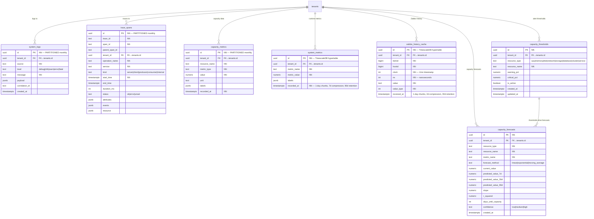
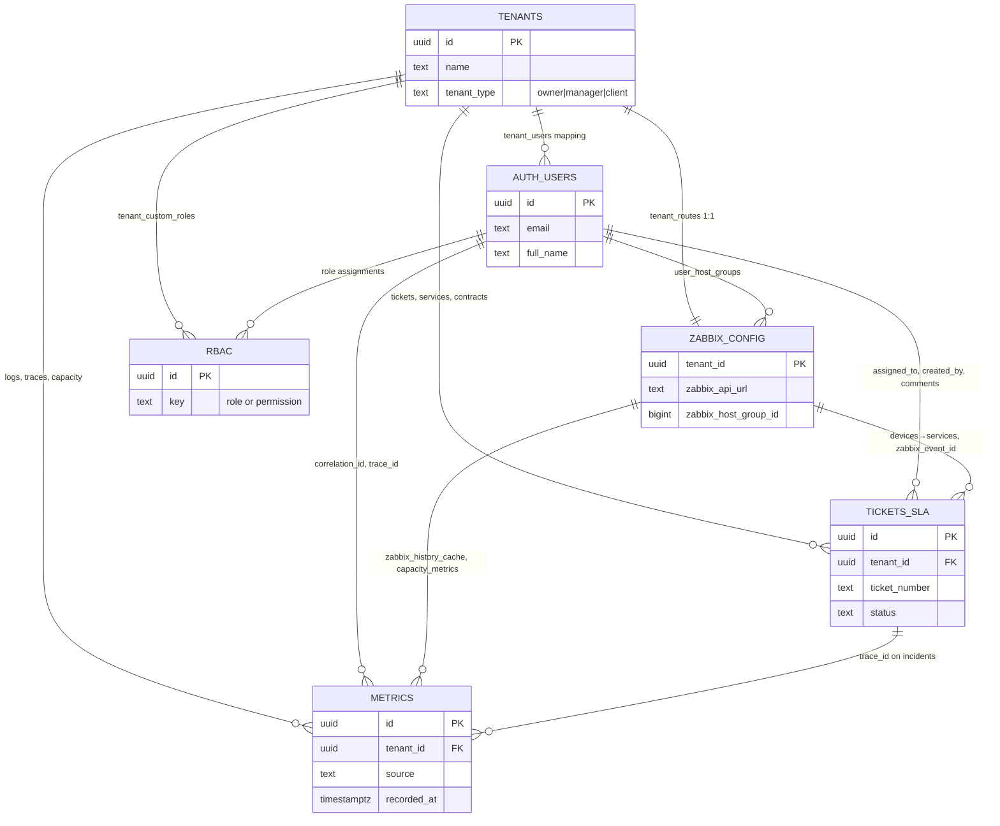

# JLMIRROR — Database Entity-Relationship Diagram

> Generated: 2026-08-11
> Scope: Core modules (Tenants, Auth/Users, RBAC, Zabbix Config, Tickets/SLA, Metrics)

## Legend

- PK = Primary Key
- FK = Foreign Key
- UQ = Unique Constraint
- NN = Not Null
- RLS = Row Level Security enabled

## 1. Tenant Management

```mermaid
erDiagram
    tenants {
        uuid id PK "NN"
        text name "NN"
        text cnpj UQ "Brazilian company ID"
        date contract_end_date
        text status "active|inactive|suspended"
        uuid parent_tenant_id FK "self-ref for hierarchy"
        text tenant_type "owner|manager|client"
        timestamptz created_at
        timestamptz updated_at
    }

    tenant_routes {
        uuid tenant_id PK "FK→tenants.id, 1:1"
        text cluster_id "NN"
        text cluster_host "NN"
        text cluster_database_name "NN"
        text schema_name UQ "format tenant_[a-f0-9]{8}"
        bigint zabbix_host_group_id
        text zabbix_api_url
        text zabbix_encrypted_token "AES-256-GCM"
        text zabbix_token_iv
        text zabbix_token_tag
        text zabbix_connector_token
        boolean is_enterprise
        text status
        timestamptz created_at
        timestamptz updated_at
    }

    tenant_users {
        uuid user_id PK "FK→users.id, composite PK"
        uuid tenant_id PK "FK→tenants.id, composite PK"
        text role "system role key"
        text scope "global|tenant"
        timestamptz created_at
    }

    tenant_settings {
        uuid id PK "NN"
        uuid tenant_id FK UQ "FK→tenants.id, 1:1"
        jsonb branding "company_name, logo_url, colors, custom_css"
        jsonb smtp "SMTP config"
        jsonb slack "Slack config"
        jsonb discord "Discord config"
        jsonb telegram "Telegram config"
        jsonb limits "max_devices, max_users, etc."
        jsonb security_policies "password, session, MFA"
        jsonb ip_whitelist "allowed IPs"
        timestamptz updated_at
    }

    client_companies {
        uuid tenant_id PK "FK→tenants.id, 1:1"
        text legal_name "NN"
        text cnpj
        numeric contract_value
        int billing_day
        text billing_cycle
        text plan_tier
        uuid technical_contact_id FK "FK→client_contacts.id"
        uuid commercial_contact_id FK "FK→client_contacts.id"
        text address_street
        text address_city
        text address_state
        text address_zip
        text address_country
        timestamptz created_at
    }

    client_contacts {
        uuid id PK "NN"
        uuid tenant_id FK "FK→tenants.id"
        text name "NN"
        text email
        text phone
        text role
        text department
        boolean is_primary
        boolean is_active
        timestamptz created_at
    }

    tenants ||--|| tenant_routes : "routes to cluster+zabbix"
    tenants ||--o{ tenant_users : "has members"
    tenants ||--|| tenant_settings : "configured by"
    tenants ||--|| client_companies : "owned by (client type)"
    tenants ||--o{ client_contacts : "has contacts"
    tenants ||--o{ tenants : "parent hierarchy"
    client_companies ||--o{ client_contacts : "technical_contact"
    client_companies ||--o{ client_contacts : "commercial_contact"
    users ||--o{ tenant_users : "member of"
```

## 2. Authentication & Users

```mermaid
erDiagram
    users {
        uuid id PK "NN"
        text email UQ "NN"
        text password_hash "NN"
        text full_name "NN — NOT name"
        boolean is_active
        boolean must_change_password
        text phone
        timestamptz last_login_at
        timestamptz created_at
        timestamptz updated_at
    }

    sessions {
        uuid id PK "NN"
        uuid user_id FK "FK→users.id"
        text refresh_token_hash "NN"
        timestamptz expires_at "NN"
        text device_fingerprint
        text ip_address
        text user_agent
        text device_label
        timestamptz created_at
    }

    trusted_devices {
        uuid id PK "NN"
        uuid user_id FK "FK→users.id"
        text device_fingerprint "NN"
        text device_label
        text ip_address
        text user_agent
        timestamptz created_at
    }

    password_reset_tokens {
        uuid id PK "NN"
        uuid user_id FK "FK→users.id"
        text token_hash "NN"
        timestamptz expires_at "NN"
        timestamptz used_at
        text requested_ip
        timestamptz created_at
    }

    user_mfa_totp {
        uuid id PK "NN"
        uuid user_id FK UQ "FK→users.id, 1:1"
        text secret "NN"
        jsonb recovery_codes "10 SHA-256 hashed codes"
        boolean is_enabled
        timestamptz enabled_at
        timestamptz created_at
    }

    user_webauthn_credentials {
        uuid id PK "NN"
        uuid user_id FK "FK→users.id"
        text credential_id UQ "NN"
        jsonb public_key "NN"
        int counter
        text device_type
        text name
        boolean is_enabled
        timestamptz created_at
    }

    mfa_challenges {
        uuid id PK "NN"
        uuid user_id FK "FK→users.id"
        text method "totp|webauthn"
        text challenge_token "NN"
        timestamptz expires_at "NN"
        boolean consumed
        timestamptz created_at
    }

    user_profiles {
        uuid id PK "NN"
        uuid tenant_id FK "FK→tenants.id"
        uuid user_id FK "FK→users.id"
        text display_name
        text bio
        text phone
        text location
        text timezone
        text locale
        text avatar_url
        text avatar_initials
        text avatar_color
        text job_title
        text department
        jsonb skills
        jsonb social_links
        jsonb notification_preferences
        text theme
        text density
        boolean sidebar_collapsed
        jsonb dashboard_layout
        timestamptz updated_at
    }

    user_sessions {
        uuid id PK "NN"
        uuid tenant_id FK "FK→tenants.id"
        uuid user_id FK "FK→users.id"
        text session_token_hash "NN"
        text device_type
        text device_name
        text ip_address
        text user_agent
        text location
        boolean is_active
        timestamptz last_activity
        timestamptz expires_at
        timestamptz created_at
    }

    user_security_log {
        uuid id PK "NN"
        uuid tenant_id FK "FK→tenants.id"
        uuid user_id FK "FK→users.id"
        text event_type "login|logout|password_change|mfa_enable|mfa_disable|token_refresh|session_revoked|password_reset_request|password_reset_complete|email_change|profile_update|avatar_change|preferences_update"
        text ip_address
        text user_agent
        jsonb metadata
        timestamptz created_at
    }

    users ||--o{ sessions : "has refresh sessions"
    users ||--o{ trusted_devices : "trusts devices"
    users ||--o{ password_reset_tokens : "resets via"
    users ||--|| user_mfa_totp : "TOTP MFA"
    users ||--o{ user_webauthn_credentials : "WebAuthn credentials"
    users ||--o{ mfa_challenges : "MFA challenges"
    users ||--o{ user_profiles : "extended profile"
    users ||--o{ user_sessions : "session tracking"
    users ||--o{ user_security_log : "security events"
```

## 3. RBAC (Role-Based Access Control)

```mermaid
erDiagram
    roles {
        uuid id PK "NN"
        text key UQ "NN — e.g. global:admin, tenant:admin"
        text description
        boolean is_system
        timestamptz created_at
    }

    permissions {
        uuid id PK "NN"
        text key UQ "NN — e.g. zabbix:read, tickets:write"
        text description
        text category "zabbix|tenant|audit|auth|automation|observability|security|ai|system|admin|self|dashboard|sla|ssl|tasks|tickets|webhooks|api_keys|assets|scripts|compliance|health|status_page|tv|changes|kb|notifications|reports|feature_flags|discovery|data_transfer|backup|billing|finops|capacity|drift|chatops|itsm|marketplace|client_portal|traces"
        timestamptz created_at
    }

    role_permissions {
        uuid role_id PK "FK→roles.id, composite PK"
        uuid permission_id PK "FK→permissions.id, composite PK"
        timestamptz created_at
    }

    attribute_policies {
        uuid id PK "NN"
        text role_key "NN"
        text permission_key "NN"
        text condition_type "time_window|ip_range|location|device"
        jsonb condition_value "NN"
        text effect "allow|deny"
        int priority
        timestamptz created_at
    }

    tenant_custom_roles {
        uuid id PK "NN"
        uuid tenant_id FK "FK→tenants.id"
        text key "NN"
        text description
        boolean is_active
        timestamptz created_at
    }

    tenant_custom_role_permissions {
        uuid role_id PK "FK→tenant_custom_roles.id, composite PK"
        uuid permission_id PK "FK→permissions.id, composite PK"
        timestamptz created_at
    }

    roles ||--o{ role_permissions : "grants"
    permissions ||--o{ role_permissions : "granted to roles"
    roles ||--o{ attribute_policies : "ABAC conditions"
    permissions ||--o{ attribute_policies : "ABAC conditions"
    tenants ||--o{ tenant_custom_roles : "custom roles"
    tenant_custom_roles ||--o{ tenant_custom_role_permissions : "grants"
    permissions ||--o{ tenant_custom_role_permissions : "granted to custom roles"
```

## 4. Zabbix Configuration & Devices

```mermaid
erDiagram
    tenant_routes {
        uuid tenant_id PK "FK→tenants.id, 1:1"
        text cluster_id "NN"
        text cluster_host "NN"
        text cluster_database_name "NN"
        text schema_name UQ "format tenant_[a-f0-9]{8}"
        bigint zabbix_host_group_id "Zabbix host group"
        text zabbix_api_url "Zabbix API endpoint"
        text zabbix_encrypted_token "AES-256-GCM encrypted"
        text zabbix_token_iv "initialization vector"
        text zabbix_token_tag "auth tag"
        text zabbix_connector_token "connector token"
        boolean is_enterprise
        text status
        timestamptz created_at
        timestamptz updated_at
    }

    devices {
        uuid id PK "NN"
        uuid tenant_id FK "FK→tenants.id"
        text hostname "NN"
        text ip
        text type
        text device_type
        text vendor
        text model
        text status
        boolean is_active
        bigint zabbix_host_id "UQ with tenant_id"
        timestamptz last_seen_at
        timestamptz created_at
        timestamptz updated_at
    }

    user_host_groups {
        uuid id PK "NN"
        uuid tenant_id FK "FK→tenants.id"
        uuid user_id FK "FK→users.id"
        bigint zabbix_host_group_id "NN"
        text zabbix_host_group_name "NN"
        timestamptz created_at
    }

    tenants ||--|| tenant_routes : "Zabbix config"
    tenants ||--o{ devices : "device inventory"
    tenants ||--o{ user_host_groups : "host group mappings"
    users ||--o{ user_host_groups : "visible host groups"
    tenant_routes ||--o{ devices : "syncs from Zabbix host group"
```

## 5. Tickets, SLA & Service Management

```mermaid
erDiagram
    tickets {
        uuid id PK "NN"
        uuid tenant_id FK "FK→tenants.id"
        text ticket_number UQ "NN — generated via RPC"
        uuid category_id FK "FK→ticket_categories.id"
        text subject "NN"
        text description
        int priority "0-4"
        text status "open|in_progress|resolved|closed|cancelled"
        uuid assigned_to FK "FK→users.id"
        text requester_name
        text requester_email
        text requester_phone
        text source
        text_array tags
        jsonb metadata
        timestamptz sla_response_due_at
        timestamptz sla_resolution_due_at
        timestamptz sla_responded_at
        timestamptz sla_resolved_at
        uuid created_by FK "FK→users.id"
        timestamptz created_at
        timestamptz updated_at
    }

    ticket_categories {
        uuid id PK "NN"
        uuid tenant_id FK "FK→tenants.id"
        text name "NN"
        uuid parent_id FK "self-ref → ticket_categories.id"
        text description
        text color
        int sla_response_hours
        int sla_resolution_hours
        boolean is_active
        timestamptz created_at
    }

    ticket_comments {
        uuid id PK "NN"
        uuid tenant_id FK "FK→tenants.id"
        uuid ticket_id FK "FK→tickets.id"
        uuid user_id FK "FK→users.id"
        text body "NN"
        boolean is_internal
        timestamptz created_at
    }

    ticket_work_logs {
        uuid id PK "NN"
        uuid tenant_id FK "FK→tenants.id"
        uuid contract_id FK "FK→tenant_contracts.id"
        uuid ticket_id FK "FK→tickets.id"
        uuid user_id FK "FK→users.id"
        text work_type "diagnosis|fix|monitoring|meeting|research|travel"
        timestamptz started_at "NN"
        timestamptz ended_at
        int duration_seconds
        boolean is_billable
        text description
        text status "active|paused|finished"
        timestamptz created_at
    }

    tenant_contracts {
        uuid id PK "NN"
        uuid tenant_id FK "FK→tenants.id"
        text contract_number UQ "NN"
        text client_name "NN"
        text contract_type "monthly_support|project_fixed|hour_bank|sla_based|custom"
        text status "active|expired|cancelled|pending"
        date start_date
        date end_date
        int monthly_hours
        numeric hourly_rate
        text carry_over_rule "none|unlimited|limited|expire"
        jsonb metadata
        timestamptz created_at
        timestamptz updated_at
    }

    services {
        uuid id PK "NN"
        uuid tenant_id FK "FK→tenants.id"
        text name "NN"
        text description
        text service_type
        text status "operational|degraded|down|maintenance"
        jsonb device_ids "linked device UUIDs"
        numeric sla_target_percentage
        text coverage_hours
        text coverage_timezone
        jsonb coverage_days
        text priority "low|medium|high|critical"
        bigint zabbix_service_id
        jsonb metadata
        boolean is_active
        timestamptz created_at
        timestamptz updated_at
    }

    service_incidents {
        uuid id PK "NN"
        uuid tenant_id FK "FK→tenants.id"
        uuid service_id FK "FK→services.id"
        text title "NN"
        text description
        text severity "info|warning|major|critical|maintenance"
        text status "investigating|identified|monitoring|resolved|scheduled"
        timestamptz started_at "NN"
        timestamptz resolved_at
        int downtime_seconds
        text root_cause
        text resolution_notes
        jsonb affected_device_ids
        uuid ticket_id FK "FK→tickets.id"
        bigint zabbix_event_id
        timestamptz created_at
        timestamptz updated_at
    }

    maintenance_windows {
        uuid id PK "NN"
        uuid tenant_id FK "FK→tenants.id"
        text name "NN"
        text description
        jsonb device_ids
        timestamptz start_at "NN"
        timestamptz end_at "NN"
        text status "scheduled|active|completed|cancelled"
        text maintenance_type "scheduled|emergency|corrective"
        jsonb metadata
        timestamptz created_at
    }

    status_pages {
        uuid id PK "NN"
        uuid tenant_id FK "FK→tenants.id"
        text slug UQ "NN — public URL slug"
        text page_title "NN"
        text company_name
        boolean is_published
        jsonb config
        timestamptz created_at
        timestamptz updated_at
    }

    tenants ||--o{ tickets : "owns tickets"
    tenants ||--o{ ticket_categories : "has categories"
    tenants ||--o{ tenant_contracts : "has contracts"
    tenants ||--o{ services : "defines services"
    tenants ||--o{ maintenance_windows : "schedules maintenance"
    tenants ||--o{ status_pages : "public status pages"
    ticket_categories ||--o{ tickets : "categorizes"
    ticket_categories ||--o{ ticket_categories : "parent hierarchy"
    tickets ||--o{ ticket_comments : "has comments"
    tickets ||--o{ ticket_work_logs : "has work logs"
    tickets ||--o{ service_incidents : "linked incident"
    tenant_contracts ||--o{ ticket_work_logs : "billable against"
    services ||--o{ service_incidents : "has incidents"
    users ||--o{ tickets : "assigned to"
    users ||--o{ tickets : "created by"
    users ||--o{ ticket_comments : "authored"
    users ||--o{ ticket_work_logs : "logged by"
```

## 6. Metrics, Traces & Observability



## Cross-Module Relationships



---

> **Notes:**
>
> - All tenant-scoped tables enforce RLS via `app.current_tenant_id` session setting.
> - `tenants` is the root aggregate — nearly every table has a `tenant_id` FK.
> - `users` is global (public schema) and linked to tenants via the `tenant_users` join table.
> - `tenant_routes` is a 1:1 mapping carrying both cluster DB config and Zabbix integration config.
> - Partitioned tables (`system_logs`, `trace_spans`, `capacity_metrics`) use monthly partitioning.
> - TimescaleDB hypertables (`system_metrics`, `zabbix_history_cache`) use 1-day chunks with compression and retention policies.
> - `user_mfa_totp` is 1:1 with `users`; `user_webauthn_credentials` is 1:many.
> - `ticket_categories` supports self-referential hierarchy via `parent_id`.
> - `tenant_contracts` feed `ticket_work_logs` for billable hour tracking.
